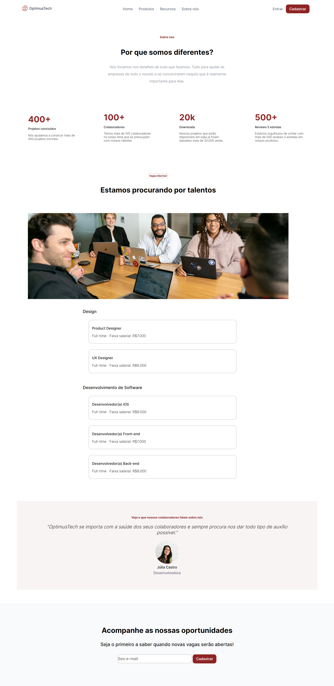

 

### #7daysofcode HTML e CSS - Alura </h2>

O desafio 7 Dayss de HTML e CSS é uma prática ofericida pela Alura em diversas tecnologia durante os 7 dias, o objetivo é usar todo o seu conhecimento de HTML e CSS para desenvolver uma página real a partir de um layout no Figma, algo que é praticado no dia-a-dia no mercado.

##### Tecnologias utilizadas 

 
 

#### Link Deploy 

#### Resultado

 

